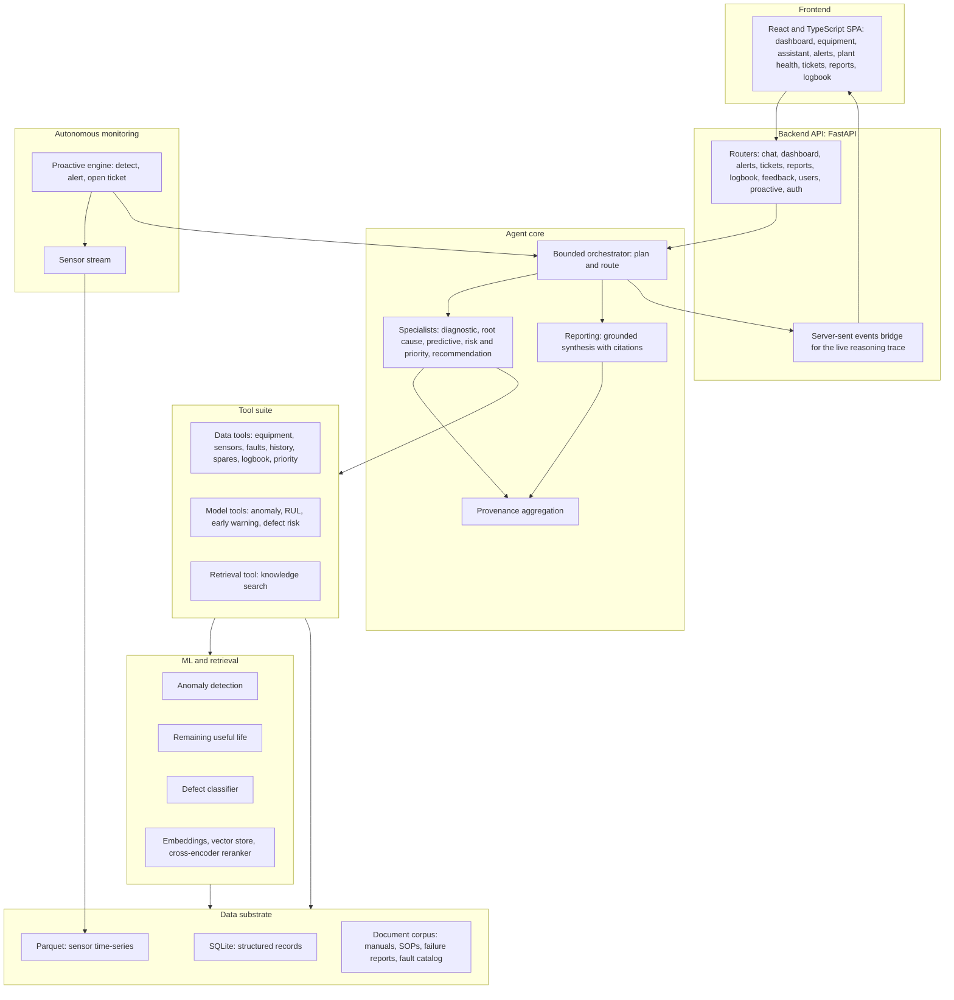

# Maintenance Wizard: System Design and Submission Document

This document describes the design of Maintenance Wizard, a decision-support system for predictive and prescriptive maintenance on a steel Hot Strip Mill. It maps the implementation to the required documentation areas: problem context, system architecture, technology stack, data and system flow, model design and reasoning pipeline, alerting and prediction logic, coverage of the required outputs, worked examples, feedback-driven improvement, installation and configuration, and an honest statement of assumptions and limitations. Every section is grounded in the actual code.

## 1. Overview and problem context

A Hot Strip Mill rolls heated steel slabs into coiled strip on a continuous line that runs around the clock. The line depends on a small number of large rotating assets: finishing-stand work-roll bearings, main-drive gearboxes, and down-coiler mandrels. When one of these degrades unnoticed, the result is an unplanned stoppage that is expensive, disrupts downstream scheduling, and can be unsafe.

Maintenance teams already have the signals they need, but those signals are scattered. Vibration and temperature trends sit in one system, the fault catalog and standard operating procedures in another, spare-parts lead times in a third, and years of judgment in handwritten logbooks. Pulling them together under time pressure is slow and inconsistent, and the reasoning behind a decision is rarely written down.

Maintenance Wizard consolidates these sources behind a single operations console and adds an assistant that reasons over them. For a given asset it can diagnose the probable fault, find the likely root cause, estimate how long the asset can keep running, classify the risk, prioritize the work against the rest of the plant, and recommend immediate and longer-term actions. Crucially, every conclusion is traceable: each statement in an answer carries citations back to the record, document section, sensor window, or computation that produced it. The system also watches the monitored assets on its own, raises alerts on genuine abnormalities, opens work orders, and records what it did.

The project ships with a self-contained synthetic dataset for a representative finishing area, so it runs end to end on a single machine without a plant connection.

## 2. System architecture

The system is built in clear layers. Lower layers know nothing about the layers above them, and each capability is exposed to the agent as a tool with a typed result that carries its own provenance.



Request flow, at a glance: the browser calls the API, the API hands a question to the bounded orchestrator, the orchestrator plans and delegates to specialists, the specialists call data, model, and retrieval tools, a reporting step synthesizes a grounded answer with citations, and the trace plus the cited answer stream back to the browser. The autonomous engine follows the same path, except the trigger is a detected abnormality rather than a typed question.

The layers are:

- Data substrate. Structured records in SQLite, sensor time-series in Parquet, and a small document corpus, all derived from one specification and validated for cross-source consistency.
- Retrieval and machine learning. Local embeddings and a cross-encoder reranker over the documents, and trained models for anomaly detection, remaining useful life, and defect classification.
- Tool suite. A registry of typed tools that wrap the data, the retrieval, and the models. Every tool returns a result with a source list.
- Agent core. A bounded orchestration loop that plans a question, delegates to named specialists, and composes a final answer, with provenance bubbling up from the tools that were actually called.
- Backend API. A FastAPI service that exposes the dashboards, equipment data, alerts, tickets, reports, logbook, and a streaming chat endpoint, and streams the agent trace to the browser.
- Frontend. A React and TypeScript single-page application that presents the console and renders the live trace and cited outputs.
- Autonomous monitoring. A proactive engine that scores a moving sensor window, raises alerts, opens work orders, and triggers the same agent analysis.

## 3. Technology stack

Backend (from `pyproject.toml`, Python 3.11 or newer):

- Web and serving: FastAPI (>=0.115), Uvicorn (>=0.30).
- Validation and config: Pydantic (>=2.7), pydantic-settings (>=2.3), python-dotenv (>=1.0).
- Data and numerics: pandas (>=2.2), NumPy (>=1.26), pyarrow (>=16.0).
- Machine learning: scikit-learn (>=1.4).
- Retrieval: ChromaDB (>=0.5) as the vector store, fastembed (>=0.4) for local ONNX embeddings and the cross-encoder reranker.
- LLM access: an OpenAI-compatible client (openai >=1.40) plus a thin adapter layer, so the system can talk to any OpenAI-compatible chat and tool-calling endpoint.
- Auth and sessions: Authlib (>=1.3), itsdangerous (>=2.1).
- Logging: structlog (>=24.1).
- HTTP: httpx (>=0.27).
- Tooling: uv for environments and dependencies, pytest (>=8.0) and pytest-asyncio (>=0.24) for tests, Ruff (>=0.6) for linting, mypy (>=1.11) for type checks.

Frontend (from `frontend/package.json`):

- Framework: React 18 (^18.3.1) and TypeScript (^5.5.3), built with Vite (^5.3.4).
- Routing and data: react-router-dom (^6.25.1), TanStack Query (^5.51.11).
- UI and styling: Tailwind CSS (^3.4.6), lucide-react icons (^0.408.0), clsx and tailwind-merge, the Inter font.
- Charts: Recharts (^2.12.7).
- Markdown and streaming: react-markdown (^9.0.1) with remark-gfm, rehype-raw, and rehype-sanitize, and the fetch-event-source client (^2.0.1) for server-sent events.

Data formats: SQLite for structured records, Parquet for sensor series, Markdown for the document corpus, CSV for the committed source tables.

## 4. Data flow and system flow

### A user question

1. The browser posts the question to the streaming chat endpoint. The request carries a session id and the user identity.
2. The orchestrator builds its prompt from a compact equipment roster, recent conversation turns for the session, and the question, then runs a bounded planning loop on the large reasoning tier.
3. The orchestrator decides depth. A trivial lookup is answered with one direct data tool. An analytical or status question is delegated to one or more specialists.
4. Each specialist runs its own bounded loop over a restricted set of tools. The tools read structured records, summarize a sensor window, run a model, or search the document corpus. Every tool returns a typed result with a source list.
5. The specialist returns a compact finding: a short conclusion in prose, a set of extracted key facts, and the provenance harvested from the tool results it actually used.
6. A reporting step runs once over the collected findings. It is a tool-less synthesis on the large tier that writes the final answer using only the gathered findings, with inline citations, and refuses to introduce facts that are not present in those findings.
7. Provenance from every tool the specialists used is aggregated, deduplicated, and attached to the answer. The conversation memory records the turn.
8. The status updates, the tool start and end events, and the final cited answer stream back to the browser over server-sent events, so the user watches the reasoning unfold and then reads the grounded answer.

### An autonomous scan

1. The proactive engine advances over the sensor time-series and scores the most recent window for each monitored asset using the anomaly detector. This step is local and does not call the language model.
2. If an asset crosses the acute gate (a flagged anomaly whose worst sample sits in the ISO action or damage zone, or a configured severity gate), or the early-warning sweep fires, the engine acts. Each tier is debounced so one episode produces one alert and one ticket.
3. The engine opens a work order with the correct severity, then runs the same orchestrator over a comprehensive prompt for that asset, producing a full diagnosis, root cause, prediction, risk and priority, and recommendation.
4. The analysis is attached to the ticket, an alert record is created for the console to surface, and an entry is written to the digital logbook under the system author so machine actions are clearly distinguished from human ones.
5. The console polls alerts and raises a one-time banner and tone for a new, unacknowledged, role-targeted alert, and links it to the ticket and the analysis.

## 5. Model design and reasoning pipeline

### Trained machine-learning models

The models live in `backend/app/ml`, are deterministic with a fixed seed, run offline, and are each exposed to the agent as a tool that reports why, not just what.

- Anomaly detection (`detect_anomaly`). For each monitored asset the detector builds a per-asset baseline from the quiet regime and computes a robust residual z-score, using the median and a scaled median absolute deviation (the 1.4826 factor) per channel. The decision is the worst per-sample z-score against a threshold (default 6.0). An IsolationForest (200 trees) fit on the same baseline corroborates the result as a recognized multivariate method. The tool returns the score, the channels that drove it with their z-scores, and a severity mapped from the ISO 10816-3 velocity zone of the worst sample.

- Remaining useful life (`predict_rul`). A Theil-Sen robust line is fit to the degradation portion of the governing vibration channel and extrapolated to the ISO 10816-3 damage-zone onset at 4.5 mm/s, treated as the fracture-equivalent end of life. The earlier ISO action crossing at 2.8 mm/s is reported separately as the plan-the-repair horizon, and the ISO alert level is 1.4 mm/s. The tool returns the estimate in weeks with a planning interval, the trend basis, and the time-to-action horizon. Theil-Sen is chosen because it is robust to transient spikes and deterministic.

- Process-defect classification (`assess_alpha_defect_risk`). A HistGradientBoostingClassifier (which handles missing values natively) is trained on the real Round 1 hot-rolling dataset, with `class_weight="balanced"` for the strong class imbalance (about 4.88 percent positives). It is evaluated with stratified k-fold cross-validation, the decision threshold is tuned for a target recall, and the top drivers come from permutation importance. The reported metrics are cross-validation metrics; the held-out file is unlabeled, so it is used for prediction only.

- Early warning (`assess_early_warning`). A combined verdict over three explicit triggers: an acute anomaly (a flagged anomaly whose worst sample is in the ISO action or damage zone), an imminent failure (remaining useful life at or over the failure threshold, or at or below the critical horizon of two weeks), and procurement-at-risk (the lower bound of the remaining-useful-life interval is at or below the spare lead time, which is the order-now condition). The severity is critical when an acute trigger fires, high for a forward-looking trigger, and none otherwise.

Dynamic risk is folded into the priority score as a transparent additive component: the risk is the maximum of the remaining-useful-life risk and the anomaly severity, scaled by a weight (0.30) and capped so the total stays within 0 to 100.

### Retrieval pipeline

The document corpus is chunked by Markdown section, with provenance metadata on every chunk (document id, document type, equipment id, source, section, and reference tokens). Chunks are embedded with a local sentence-embedding model (BAAI/bge-small-en-v1.5, run through fastembed as ONNX, so no heavy deep-learning runtime is required) and stored in a Chroma collection. A query is embedded, retrieved by vector similarity (top 20 candidates), then re-ranked by a cross-encoder (Xenova/ms-marco-MiniLM-L-6-v2) down to the best 5. Per-asset scoping is a metadata filter, so a query about one asset sees that asset's documents plus the shared procedures. The embedder and reranker sit behind interfaces, so tests can inject deterministic fakes and run without downloading models.

### The bounded multi-specialist agent loop

The agent core is a hand-rolled, bounded tool-calling loop, not a single retrieval pass. It is designed to plan, delegate, and reason over multiple steps while staying dependable.

- Orchestrator. A bounded loop on the large reasoning tier whose available tools are the five analysis specialists plus four direct data tools (`get_equipment`, `get_spare_parts`, `get_fault_info`, `search_knowledge`) for trivial lookups. It decides depth, so it does not always pay for the full specialist chain. Its iteration cap is eight.

- Specialists. Five analysis roles share one framework and differ only by their system prompt, their allowed tools, and a key-fact extractor:
  - diagnostic: `search_knowledge`, `get_fault_info`, `get_sensor_data`, `get_equipment`, `detect_anomaly`.
  - root_cause: `search_knowledge`, `get_maintenance_history`, `get_equipment_logs`, `get_fault_info`, `get_sensor_data`.
  - predictive: `predict_rul`, `detect_anomaly`, `assess_early_warning`, `get_sensor_data`.
  - risk_priority: `compute_priority`, `assess_early_warning`, `get_equipment`, `get_spare_parts`.
  - recommendation: `search_knowledge`, `get_spare_parts`, `get_fault_info`, `get_maintenance_history`.
  Each specialist runs its own bounded loop (iteration cap five) and returns a finding whose prose is the conclusion and whose key facts and provenance are harvested programmatically from the tool results it actually called, rather than trusted from model-formatted text.

- Reporting. A sixth role with no tools (iteration cap three). After gathering, it synthesizes the final answer strictly from the collected findings, with inline citations, and is instructed not to introduce facts that are not present.

- Bounds and dependability. Every loop is iteration-capped and never spins unbounded. A failed tool is captured and reported back to the model rather than crashing the run. The model call is retried once and then degrades to a partial result, so a provider error or a rate limit never crashes a query.

The full tool suite available to the system is: `search_knowledge`, `get_equipment`, `get_sensor_data`, `get_maintenance_history`, `get_spare_parts`, `get_fault_info`, `get_equipment_logs`, `get_process_conditions`, `compute_priority`, `log_maintenance_action`, `record_feedback`, `get_logbook`, `detect_anomaly`, `predict_rul`, `assess_early_warning`, and `assess_alpha_defect_risk`.

## 6. Alerting and prediction logic

Autonomous monitoring lives in `backend/app/proactive` and the work-order side in `backend/app/tickets`.

- Sensor stream. The engine moves a window over the committed sensor time-series and scores the most recent window. This window stands in for what a real condition-monitoring feed would provide.

- Two-tier detection, both debounced. On each poll, for each monitored asset, the engine scores the window with the anomaly detector. The acute tier fires when an anomaly is flagged and its worst sample sits in the ISO action or damage zone, or a configured severity gate is crossed; it opens a high or critical work order. The predictive-advisory tier fires from the early-warning sweep (for example, the remaining-useful-life lower bound dropping to within the spare lead time); it opens a medium work order. A per-asset state machine ensures one episode produces one alert and one ticket, and clears after a recovery streak.

- Risk classification and severity. Severity is derived, not guessed. An acute crossing or an injected scenario yields critical or high; an advisory yields medium. The same severity drives the audience roles on the alert and the priority modifier.

- Opening work orders. When a tier fires, the engine opens a ticket of the matching kind (acute alarm or predictive advisory), runs the full orchestrator analysis for that asset, attaches the cited analysis to the ticket, creates an alert record, and writes a logbook entry under the system author. The ticket lifecycle is open, acknowledged, in progress, resolved, and closed, with explicit allowed transitions.

- Real-time alerts. The console polls the alerts endpoint and raises a one-time banner and tone for a new, unacknowledged, role-targeted alert, then links it to the ticket and the analysis.

Detection is local and costs no model tokens; the language model runs only on a genuine, debounced trigger.

## 7. Coverage of required outputs

This subsection maps the required outputs to the implementation, and is honest where coverage is partial.

- Probable fault diagnosis. Covered. The diagnostic specialist combines anomaly detection, the fault catalog, and the manuals to name a probable fault code and title.
- Root cause analysis. Covered. The root_cause specialist works over maintenance history, equipment logs, the fault catalog, and prior failure reports.
- Remaining useful life. Covered. The predictive specialist calls the Theil-Sen remaining-useful-life model against the ISO 10816-3 thresholds and reports a planning interval.
- Early warning of catastrophic failure. Covered. The early-warning model fires on acute anomalies, imminent remaining-useful-life, or procurement-at-risk, and the proactive engine raises a critical alert on the acute tier.
- Process-defect detection. Partial. A HistGradientBoostingClassifier is trained on the real hot-rolling data and is registered as the `assess_alpha_defect_risk` tool, with cross-validated metrics and permutation-importance drivers. It is not currently listed in any specialist's allowed tools, so the conversational agent does not call it directly today. It runs as a standalone trained model and tool and is a clear candidate to wire into the diagnostic role or a dedicated defect specialist.
- Risk level classification. Covered. Severity is classified as none, high, or critical by the early-warning logic, and risk feeds the priority score.
- Urgency assessment. Covered. The remaining-useful-life and time-to-action horizons give a concrete urgency, and the recommendation distinguishes immediate from longer-term actions.
- Bottleneck prioritization at the plant level. Covered. The priority tool ranks all assets and flags the vital few (top 20 percent), and the plant-health view rolls priority up by area so supervisors can see which part of the line is worst.
- Prioritization by process criticality, delay severity, spares availability, and procurement lead time. Covered. The priority score is a transparent weighted combination of exactly these four dimensions (criticality 0.40, delay 0.25, spares 0.15, lead time 0.20), and it returns the per-dimension breakdown.
- Step-by-step recommendations and immediate actions. Covered. The recommendation specialist produces concrete actions, and the reporting step separates immediate actions from the longer view.
- Long-term monitoring recommendations. Covered. The recommendation prose includes monitoring follow-up, informed by the remaining-useful-life horizon.
- Spare procurement strategy. Covered. The spares tool returns availability and lead time, and the early-warning procurement-at-risk trigger turns a lead-time-versus-life gap into an order-now recommendation.
- Structured maintenance reports. Covered. The reports endpoint runs the full chain for an asset and returns a structured report with sections and provenance.
- Abnormal alert reports. Covered. Each autonomous alert produces a ticket with the full cited analysis attached.
- Decision summaries. Covered. Every answer leads with a short bottom-line summary, and reports carry section findings plus a sources list.
- Digital logbook. Covered. Human and autonomous entries are recorded together, with machine entries clearly marked.

## 8. Sample input and output demonstration

The following are representative system runs. Outputs are summarized faithfully; the system itself returns inline citations on each claim.

### Example 1: F3 main-drive gearbox diagnosis (assistant)

Input query: "What's the status of the F3 main drive gearbox, and what should we do?"

What the system does: the orchestrator routes to the diagnostic, predictive, and recommendation specialists, then the reporting step. Across the run the tools called include `detect_anomaly`, `get_fault_info`, `predict_rul`, `assess_early_warning`, `search_knowledge`, `get_maintenance_history`, and `get_spare_parts`. The final answer carries 29 source citations.

Faithful summary of the output:

- Bottom line: the HSM-F3-GBX main-drive gearbox shows stage-2 gear-tooth pitting advancing toward fracture (fault F3-GBX-002). The condition is high severity and needs immediate confirmation and a spare-gear-set order. Failure could occur in as little as about 7 weeks, which is shorter than the normal 8-week lead time for the gear set, so action is needed now.
- Diagnosis: the recent sensor record shows overall vibration around 2.59 mm/s RMS, roughly 130 percent above the baseline median of 1.20 mm/s, and oil iron-particle content around 34.6 ppm, roughly 92 percent above baseline, consistent with the fault catalog signature for F3-GBX-002.
- Prediction: remaining useful life is on the order of 12 weeks, with the lower bound of the interval already inside the spare-part lead time.
- Recommendation: confirm the condition now, order a spare gear set immediately, and replace the stage-2 gear set before the remaining-useful-life horizon to avoid an unplanned shutdown.

This single answer covers probable fault, supporting evidence with named channels, remaining useful life against the lead time, and a prioritized, step-by-step action, each citation traceable to a record, a document section, a sensor window, or a computation.

### Example 2: F2 work-roll bearing, autonomous acute alarm

Input: an autonomous acute alarm on the F2 finishing-stand work-roll bearing (HSM-F2-WRB). The proactive engine detects the abnormality, opens a critical work order, and runs the full analysis.

What the system does: the orchestrator runs the complete chain, the diagnostic, root_cause, predictive, risk_priority, and recommendation specialists followed by reporting. Tools called include `detect_anomaly`, `search_knowledge`, `get_fault_info`, `get_maintenance_history`, `get_equipment_logs`, `predict_rul`, `assess_early_warning`, `compute_priority`, and `get_spare_parts`. The attached analysis carries 73 source citations.

Faithful summary of the output:

- Bottom line: the work-roll bearing on the F2 finishing stand (HSM-F2-WRB) shows an inner-race defect with a ball-pass-inner-race (BPFI) signature, with rising temperature and vibration. The condition is already in the ISO action zone and a critical early warning has been issued. Immediate lubrication inspection and a bearing replacement are required, and the replacement should be installed within the next 4 to 5 weeks to avoid failure.
- Diagnosis: probable fault F2-WRB-001, bearing temperature and vibration rising with an inner-race signature; the inner-race fault amplitude is many times the normal baseline.
- Risk and action: this is treated as a critical, time-bound event. The recommendation is to verify lubrication, isolate the equipment, replace the bearing within the stated window, and keep a close watch on the vibration and temperature trends.

This run demonstrates the autonomous path end to end: a local detection raises a real alert, opens a work order, and produces a full cited diagnosis with a clear, urgent action, all without a human typing a question.

## 9. Feedback-driven improvement

Two mechanisms let the system carry context forward, both implemented in code and both reflected in provenance.

- Conversation memory. `backend/app/conversation/memory.py` keeps an in-process session store. Each turn records the user query and the assistant's final answer with its provenance, and the most recent turns are fed back into the orchestrator prompt on the next question. This gives context-aware, multi-turn follow-ups within a session.

- Feedback-conditioned context. When an engineer records feedback on an asset or a fault, `backend/app/feedback/context.py` retrieves the relevant prior feedback for that asset and its fault codes (`for_equipment`), renders it into a short context message injected into each specialist (`as_message`), and returns source references for it (`sources`) so the conditioned answer cites which feedback shaped it. This is conditioning of future reasoning on accumulated human input, kept transparent through provenance. It conditions retrieval and reasoning rather than retraining the models.

Together these close the loop: corrections and confirmations from engineers become part of the context the system reasons over the next time the same asset or fault comes up.

## 10. Installation, configuration, and how to run

### Prerequisites

- Python 3.11 or newer and uv for environment and dependency management.
- Node.js 18 or newer and npm for the frontend.

### Install and build the local data and models

```bash
uv sync                                          # create the environment and install dependencies
uv run python -m backend.scripts.train_models    # train the anomaly and defect models
uv run python -m backend.scripts.build_index     # load SQLite and build the retrieval index
```

The synthetic source data lives under `data/raw` and is committed. The runtime database, the vector index, and the trained models are rebuilt from it by the two scripts above. The first index build downloads the local embedding model.

### Run the application

```bash
make demo   # build the single-page app, then serve the whole application from the API on port 8000
```

Then open http://127.0.0.1:8000. The deterministic surfaces (the dashboard, equipment register, alerts driven by local detection, tickets, logbook, and plant health) run on the data and models you built and need no language-model key. The conversational assistant and report generation call the configured language-model endpoint, so set an API key first (see configuration below).

For development with hot reload:

```bash
make dev   # backend on port 8000 and the Vite dev server on port 5173, together
```

### Tests and checks

```bash
make test                                         # backend test suite
cd frontend && npm run typecheck && npm run build # frontend checks
```

### Configuration via environment variables

All configuration is read from environment variables; copy `.env.example` to `.env` and fill in values. The language-model client is tiered: a small, fast tier for routing and simple sub-tasks, and a large, reasoning tier for diagnosis, planning, and reports. Each tier has its own provider, model, and API key, so the two tiers can point at different endpoints. The client targets any OpenAI-compatible chat and tool-calling endpoint, configurable per provider, so nothing is hardcoded:

```
LLM_SMALL_PROVIDER, LLM_SMALL_MODEL, LLM_SMALL_API_KEY
LLM_LARGE_PROVIDER, LLM_LARGE_MODEL, LLM_LARGE_API_KEY
```

Optional Microsoft Entra ID single sign-on is available through the OAuth authorization-code flow when `ENTRA_CLIENT_ID`, `ENTRA_CLIENT_SECRET`, and `ENTRA_TENANT_ID` are set; without them, the application uses a built-in persona picker. A `SESSION_SECRET` signs the web session and should be set to a long random value in production.

## 11. Assumptions and limitations

This section is deliberately specific and avoids overclaiming.

- Synthetic dataset. The plant data is synthetic, generated from one specification and validated for cross-source coherence (a fault code in a manual matches the maintenance log, which matches an anomaly in the sensor stream, which matches a spare part with a lead time). It models 10 assets across five areas (Coiling, Finishing, Roughing, Run-out Table, Utilities), of which three carry full sensor series and trained anomaly models: the F2 work-roll bearing (HSM-F2-WRB), the F3 main-drive gearbox (HSM-F3-GBX), and the down-coiler mandrel (HSM-DC-MND). The document corpus is small and focused: three equipment manuals, six standard operating procedures, four failure reports, and one fault catalog. The synthetic substrate is representative for demonstration, not a substitute for a real plant historian.

- What the models were trained on. The anomaly detector and the remaining-useful-life estimator operate on the synthetic per-asset sensor series and the published ISO 10816-3 velocity zones. The process-defect classifier is the one component trained on a real dataset, the Round 1 hot-rolling CSVs (anonymized features X1 to X49 per coil); its reported numbers are cross-validation metrics, and the held-out file is unlabeled, so it is used for prediction only.

- Defect classifier wiring. As noted in section 7, the defect classifier is trained and exposed as a tool but is not yet in any specialist's allowed-tool list, so the conversational agent does not currently invoke it directly. This is a known integration gap, not a missing capability.

- Sensor stream. The monitoring engine scores a moving window over the committed synthetic series rather than a live field feed. The detection, debouncing, alerting, ticketing, and logbook logic are real; the source of the samples is the synthetic series.

- Operational state persistence. The write-side operational state (tickets, alerts, and conversation memory) is held in process and is guarded for concurrent access, but it is not persisted across a server restart. The read-side substrate (assets, sensors, maintenance history, fault catalog, and the document corpus) is durable in SQLite and the vector store. Moving the operational stores onto the same SQLite layer behind the existing repository interfaces is the documented production path.

- Authentication scope. The persona quick-select path is a credential-less convenience for demonstration, and role checks shape the user interface rather than enforce a hard security boundary. The Microsoft Entra ID sign-in path is a real OAuth authorization-code flow when configured.

- Language-model dependency for narrative outputs. The deterministic surfaces and the local detection, scoring, and prioritization run without a language model. The conversational assistant and the generated reports require a configured OpenAI-compatible endpoint, and the quality of those narrative outputs depends on the chosen model. The agent loop is bounded and degrades to a partial result on a provider error, so a model outage does not crash the system.
